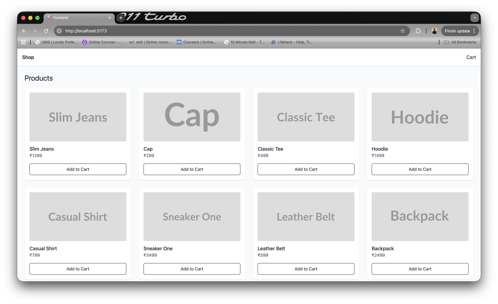
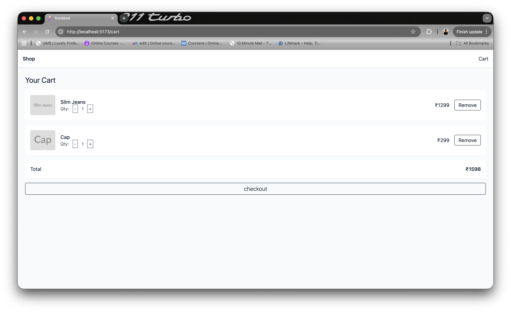
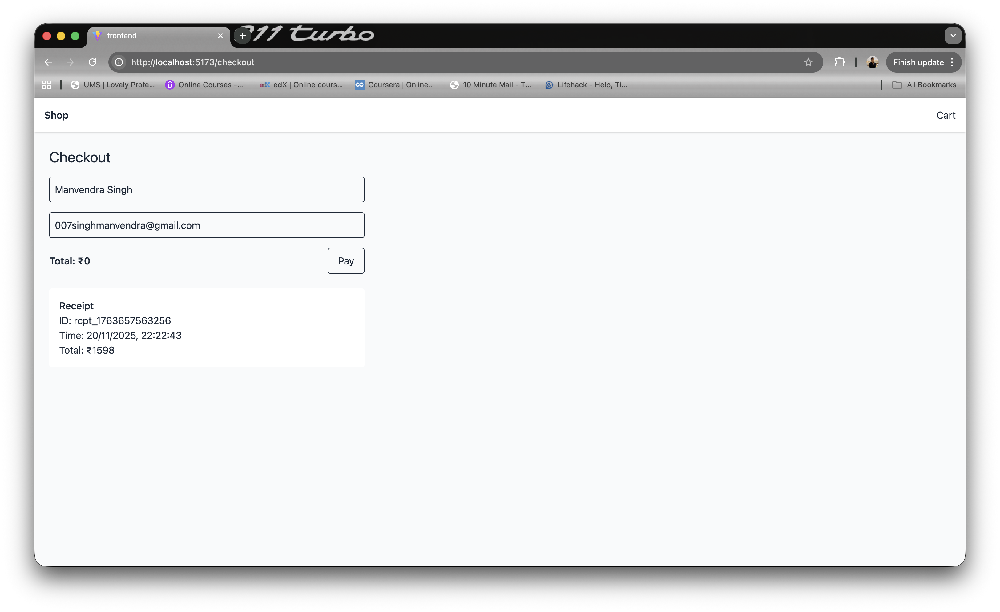

# Ecommerce App

A minimal full-stack ecommerce web app built with:

- Backend: Node.js, Express, Mongoose, MongoDB
- Frontend: Vite, React, TypeScript, Tailwind CSS, Axios, React Router, React Hot Toast

Both frontend and backend live in the same repository.

This application supports:

- Product listing
- Cart management (add, remove, update quantity)
- Checkout flow with mock receipt

---

## 1. Project Structure

```
root/
  backend/
    models/
    controllers/
    routes/
    utils/
    app.js

  frontend/
    src/
      components/
      hooks/
      services/
      App.tsx
      main.tsx
    index.html
```

---

## 2. Installation and Setup

### Step 1: Clone Repository

```
git clone <repo-url>
cd <repo-folder>
```

### Step 2: Install Dependencies

Backend:

```
cd backend
npm install
```

Frontend:

```
cd ../frontend
npm install
```

### Step 3: Environment Variables

`.env` file is provided inside the backend directory.  
Mongo URI and CORS are already configured.

### Step 4: Start Application

Backend:

```
cd backend
nodemon index.js
```

Frontend:

```
cd frontend
npm run dev
```

Application will be available at:

- Frontend: http://localhost:5173
- Backend: http://localhost:3000/api

---

## 3. API Endpoints

All endpoints are prefixed with `/api`.

---

### Products

#### GET /api/products

Returns all products.

#### POST /api/products

Creates a single product.

Body:

```json
{
  "name": "Product Name",
  "price": 1000,
  "image": "https://..."
}
```

---

### Cart

#### POST /api/cart

Adds or updates product quantity in cart.

Body:

```json
{
  "productId": "<product-id>",
  "qty": 1
}
```

Positive qty adds, negative qty reduces.

#### GET /api/cart

Returns cart items and total amount.

#### DELETE /api/cart/:id

Deletes a specific cart item by its cart item ID.

---

### Checkout

#### POST /api/checkout

Processes a mock checkout.

Body:

```json
{
  "cartItems": [{ "productId": "<id>", "qty": 2 }]
}
```

Returns:

- receipt id
- timestamp
- line items
- total

---

## 4. Frontend Overview

### Routes

```
/
 /cart
 /checkout
```

### Hooks

- `useProducts` for fetching products
- `useCart` for add/remove/update quantity

### Services

- `api.ts` (axios instance)
- `ProductsAPI`
- `CartAPI`
- `CheckoutAPI`

---

## 5. Development Notes

- Both frontend and backend must be running.
- Quantity adjustment uses `POST /api/cart` with positive or negative qty.
- Cart automatically reloads after updates.
- Checkout is mock; no real payments.

---

## 6. Screenshots

### Home Page



### Cart Page



### Checkout Page


